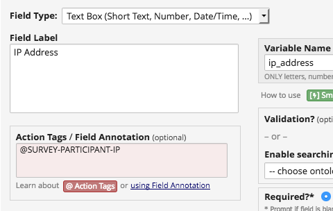
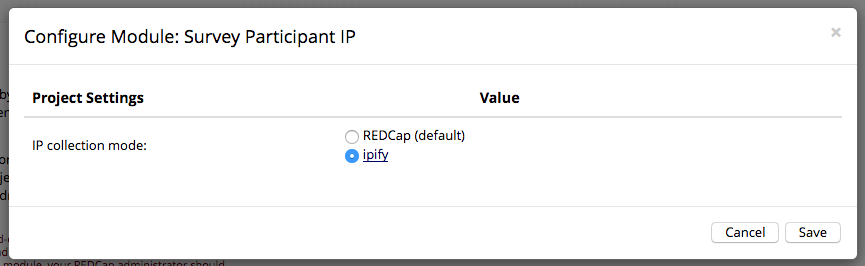

# REDCap Survey Participant IP
Provides a new action tag - `@SURVEY-PARTICIPANT-IP` - which sets a hidden field that collects the survey participant's IP address.

## Prerequisites
- REDCap >= 8.0.3

## Easy Installation
- Obtain this module from the Consortium [REDCap Repo](https://redcap.vanderbilt.edu/consortium/modules/index.php) from the Control Center.

## Manual Installation
- Clone this repo into `<redcap-root>/modules/survey_participant_ip_v<version_number>` .
- Go to **Control Center > Manage External Modules** and enable Survey Participant IP.

## How to use it
The first step is accessing Online Desinger of your project to create a text field responsible for storing the IP addresses. Then, add `@SURVEY-PARTICIPANT-IP` action tag to it.

And that's it! The field will be invisible for survey participants, and the IPs will be automatically collected.

## Using ipify to collect IP addresses
By default, REDCap system is used to get IP addresses. Alternatively, you may enable [ipify](https://www.ipify.org/), a third-party API that increases reliability of the collected IPs.

The ipify mode works from the client browser, so keep in mind that survey participants may spoof the IP value by via browser developer tools.

## Important
Please keep in mind an IP address can be easily spoofed (e.g. VPN, proxy servers), so there is no guaranteed way to get a "real" IP.
